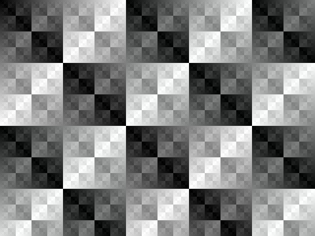
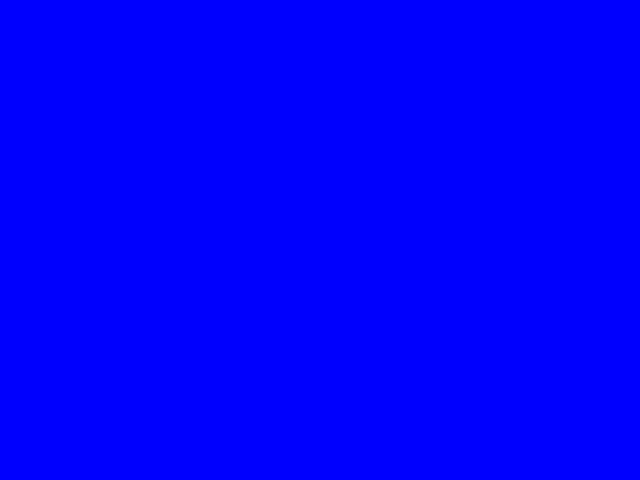
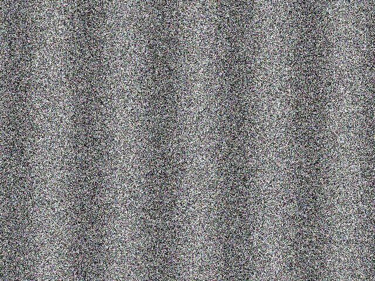
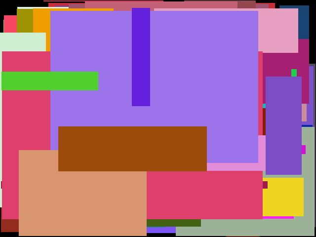
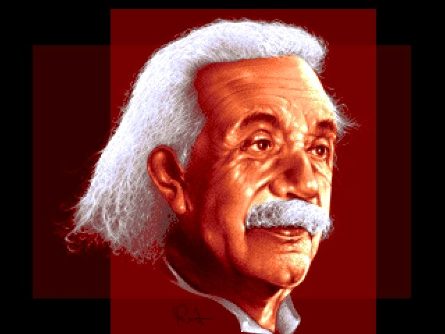
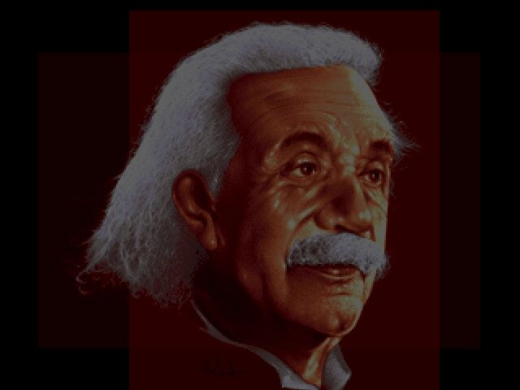
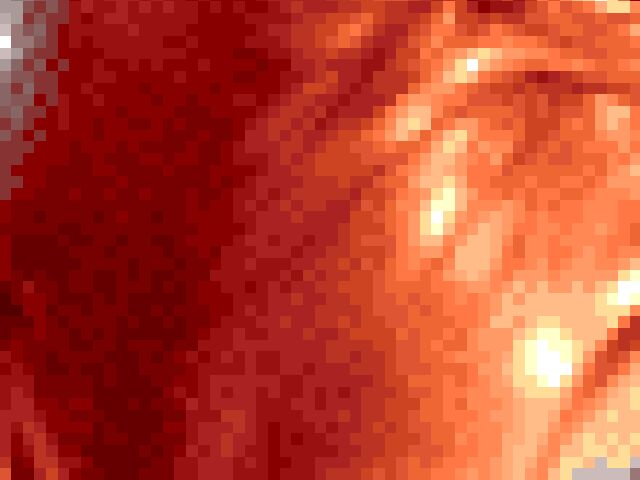
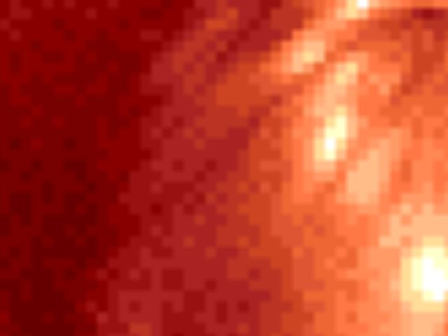

# html5-typescript-canvas

This repository demonstrates low-level pixel operations on an HTML5 canvas using TypeScript. The focus is on a "C"-style programming approach, prioritizing minimalism and direct control without relying on third party libraries or language extensions.

## Key Features
- **Low-level pixel operations**: direct manipulation of the canvas at the pixel level
- **TypeScript implementation**: strong typing and modern JavaScript features for maintainable code
- **Minimal dependencies**: no heavy frameworks or libraries - just lean and mean, straightforward programming

## Getting Started

### Prerequisites
These instructions are tailored for macOS. If you're using a different operating system, then commands and package installation methods may vary.

### 1. Install Required Tools
Ensure you have the following tools installed:
- **TypeScript**: install globally with:
  ```bash
  npm install -g typescript
  ```
- **http-server**: install globally with:
  ```bash
  npm install -g http-server
  ```

### 2. Start the TypeScript Watcher
Run the following command in the project root to monitor changes to `.ts` files and compile them automatically:
```bash
tsc --watch
```

### 3. Start the Local Web Server
In a separate terminal, run the following command to serve the project files locally:
```bash
http-server --cors -c-1
```

Once started, navigate to the provided URL (e.g., `http://127.0.0.1:8080`) to view the project.

### 4. Stopping the Processes
- To stop the **TypeScript watcher**, press `ctrl + c` in the terminal running `tsc --watch`
- To stop the **Local Web server**, press `ctrl + c` in the terminal running `http-server`

## Effects

### 1. Template

**Description:** Generates an XOR pattern all over the canvas. A good starting point for implementing another effect.



[View source code](./source/examples/00template/)

### 2. Canvas

**Description:** Clears the background of the canvas by turning it blue. Not much of an effect is it?



[View source code](./source/examples/01canvas/)

### 3. Pixels

**Description:** Renders the "ant war" effect with randomized brightness, dynamic noise, and wavy distortions. The effect mimics the look of an analog TV signal with no input.



[View source code](./source/examples/02pixels/)

### 4. Rectangles

**Description:** Renders the dynamic effect by drawing a randomly colored rectangle on the canvas.



[View source code](./source/examples/03rectangles/)

### 5. Image

**Description:** Loads the image asynchronously and draws it onto the canvas. The image is the classic "einstein" by RA from the demo group Nooon.



[View source code](./source/examples/04image/)

### 6. Fade (alpha channel)

**Description:** An alpha blending effect where an image fades in and out over time using a sinusoidal curve for the alpha channel.


[View source code](./source/examples/05fadealpha/)

### 7. Fade (RGB channels)

**Description:** A blending effect where an image fades in and out over time using a sinusoidal curve for the RGB channels.



[View source code](./source/examples/06fadergb/)

### 8. Zoom

**Description:** A zoom effect where the image oscillates between a minimum and maximum zoom level, centering the zoom at the middle of the screen.



[View source code](./source/examples/07zoom/)

### 9. Zoom (bi)

**Description:** A zoom effect where the image oscillates between a minimum and maximum zoom level, centering the zoom at the middle of the screen. The image is scaled smoothly using bilinear interpolation.



[View source code](./source/examples/08zoombi/)

## License
This project is licensed under the MIT License.

## Author
Developed by Patrik Sporre.