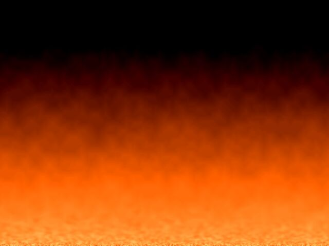
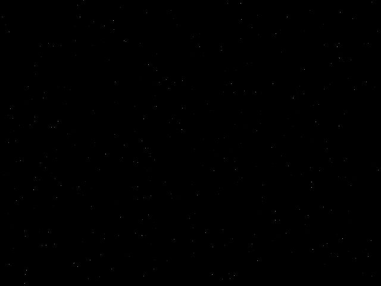
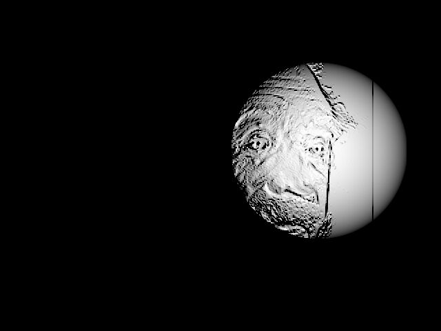
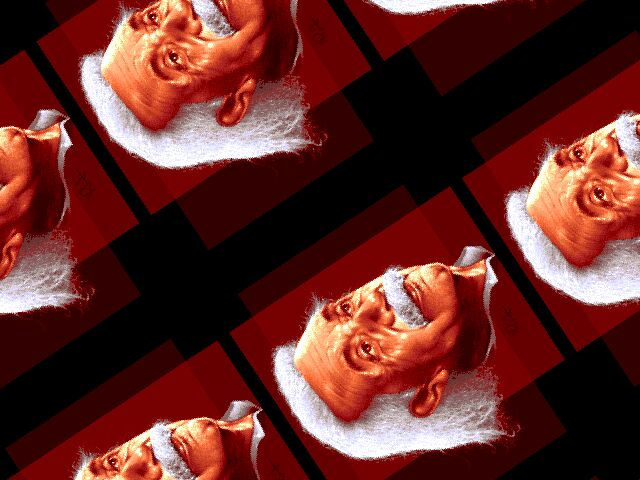

# html5-typescript-canvas

This repository showcases low-level pixel manipulation techniques on an HTML5 canvas using TypeScript. The project adopts a "C"-style programming approach, emphasizing minimalism and direct control, avoiding reliance on third-party libraries or extensive language abstractions.

The visual effects featured in this repository draw heavy inspiration from the demo scene of the 1990s, a subculture of programmers and digital artists who created technical showcases on platforms like the Amiga, Atari, and PC. The demo scene is renowned for its creativity and innovation, pushing the limits of hardware to produce stunning visuals, intricate animations, and synchronized music — all within highly constrained environments.

By revisiting and recreating these iconic effects, this project aims to celebrate the artistry and ingenuity of the demo scene while offering a modern take using HTML5 and TypeScript.

## Key Features
- **Low-level pixel operations**: direct manipulation of the canvas at the pixel level
- **TypeScript implementation**: strong typing and modern JavaScript features for maintainable code
- **Minimal dependencies**: no heavy frameworks or libraries - just lean and mean, straightforward programming

## Getting Started

### Prerequisites
These instructions are tailored for macOS. If you're using a different operating system, then commands and package installation methods may vary.

### 1. Install Required Tools
Ensure you have the following tools installed:
- **TypeScript**: install globally with:
  ```bash
  npm install -g typescript
  ```
- **http-server**: install globally with:
  ```bash
  npm install -g http-server
  ```

### 2. Start the TypeScript Watcher
Run the following command in the project root to monitor changes to `.ts` files and compile them automatically:
```bash
tsc --watch
```

### 3. Start the Local Web Server
In a separate terminal, run the following command to serve the project files locally:
```bash
http-server --cors -c-1
```

Once started, navigate to the provided URL (e.g., `http://127.0.0.1:8080`) to view the project.

### 4. Stopping the Processes
- To stop the **TypeScript watcher**, press `ctrl + c` in the terminal running `tsc --watch`
- To stop the **Local Web server**, press `ctrl + c` in the terminal running `http-server`

## Effects

### 1. Template

**Description:** Generates an XOR pattern all over the canvas. A good starting point for implementing another effect.


[View source code](./source/examples/00template/)

### 2. Canvas

**Description:** Clears the background of the canvas by turning it blue. Not much of an effect is it?


[View source code](./source/examples/01canvas/)

### 3. Pixels

**Description:** Renders the "ant war" effect with randomized brightness, dynamic noise, and wavy distortions. The effect mimics the look of an analog TV signal with no input.


[View source code](./source/examples/02pixels/)

### 4. Rectangles

**Description:** Renders the dynamic effect by drawing a randomly colored rectangle on the canvas.


[View source code](./source/examples/03rectangles/)

### 5. Image

**Description:** Loads the image asynchronously and draws it onto the canvas. The image is the classic "einstein" by RA from the demo group Nooon.


[View source code](./source/examples/04image/)

### 6. Fade (alpha channel)

**Description:** An alpha blending effect where an image fades in and out over time using a sinusoidal curve for the alpha channel.


[View source code](./source/examples/05fadealpha/)

### 7. Fade (RGB channels)

**Description:** A blending effect where an image fades in and out over time using a sinusoidal curve for the RGB channels.


[View source code](./source/examples/06fadergb/)

### 8. Zoom

**Description:** A zoom effect where the image oscillates between a minimum and maximum zoom level, centering the zoom at the middle of the screen.


[View source code](./source/examples/07zoom/)

### 9. Zoom (Bilinear)

**Description:** A zoom effect where the image oscillates between a minimum and maximum zoom level, centering the zoom at the middle of the screen. The image is scaled smoothly using bilinear interpolation.


[View source code](./source/examples/08zoombi/)

### 10. Grayscale

**Description:** Showcasing a simple filter effect where the image is turned into grayscale before being drawn to the canvas.


[View source code](./source/examples/09grayscale/)

### 11. Fire

**Description:** The classic fire effect.



[View source code](./source/examples/10fire/)

### 12. Plasma

**Description:** A classic dynamic plasma effect using a smooth color palette and sinusoidal calculations. The plasma effect includes time-based motion and a dynamically drifting center of gravity for visual variation. Inspired by the plasma developed by Sean (mrkite) at https://github.com/mrkite/demofx, with fixes for full 256 color usage in the color computation.


[View source code](./source/examples/11plasma/)

### 13. Moire

**Description:** A dynamic moiré effect using two moving foci. The interference pattern evolves over time.


[View source code](./source/examples/12moire/)

### 14. Starfield (2D)

**Description:** A 2D star field effect where stars move horizontally with random speeds and brightness. Stars wrap around the screen, reappearing on the left side with new properties when they exit on the right.


[View source code](./source/examples/13stars2d/)

### 15. Starfield (3D)

**Description:** A 3D star field effect where stars move towards the viewer from random positions in 3D space. Closer stars appear brighter, and when stars reach the screen or move outside the viewable area, they are reset to a random position at maximum depth.



[View source code](./source/examples/14stars3d/)

### 16. Bump mapping (the core principle)

**Description:** A 2D bump mapping effect using a generated height map and a moving light source. The light source simulates movement across the height map, creating dynamic shading.


[View source code](./source/examples/15bump/)

### 17. Bump mapping (image)

**Description:** A dynamic bump mapping effect over an image that emphasizes depth and texture using a height map derived from the image. A moving light source, traversing a Lissajous curve, interacts dynamically with the height map to create an engaging interplay of light and shadow. The implementation includes three bump mapping variants: real-time per-pixel computation (default, key "1"), a precomputed Phong map for combined diffuse and specular lighting (key "2"), and a precomputed environment map for efficient lighting (key "3").



[View source code](./source/examples/16bumpimage/)

### 18. Rotozoomer

**Description:** A classic rotozoomer effect where a tiled image rotates and zooms dynamically.



[View source code](./source/examples/17rotozoom/)

### 19. Water

**Description:** A dynamic water ripple effect over a bitmap image. Ripples are generated by a moving source that follows a Lissajous curve, and wave propagation is simulated using a height map and damping. The effect distorts the image in real-time to mimic the appearance of water ripples.


[View source code](./source/examples/18water/)

### 20. Twirl

**Description:** A dynamic twirl effect over an image. The effect distorts the image based on a center point, where the distortion intensity oscillates sinusoidally to create a "dancing" twirl motion.


[View source code](./source/examples/19twirl/)

### 21. Metaballs

**Description:** A 2D metaballs effect where metaballs move along dynamic Lissajous paths and generate a scalar field visualized in grayscale. The effect emphasizes areas of overlapping influence between metaballs with brighter intensities, creating a visually dynamic simulation.


[View source code](./source/examples/20metaballs/)

### 22. Twister (single color)

**Description:** A vertical twister effect, simulating a twisting block with four sides. The sides are colored differently (red, green, blue, purple) and the twist animates based on a sinusoidal function. The amplitude of the twist oscillates over time, giving a dynamic visual effect. Use keys '1' to '4' to select twist. Use key 'f' for flat rendering, 'g' for Gouraud rendering, and 't' for Gouraud texture rendering.


[View source code](./source/examples/21twister/)

## License
This project is licensed under the MIT License.

## Contact
- **Author**: Patrik Sporre  
- **LinkedIn**: [linkedin.com/in/patriksporre](https://linkedin.com/in/patriksporre)  
- **Bluesky**: [bsky.app/profile/patriksporre.se](https://bsky.app/profile/patriksporre.se)
- **Twitter / X**: [x.com/patriksporre](https://x.com/patriksporre)